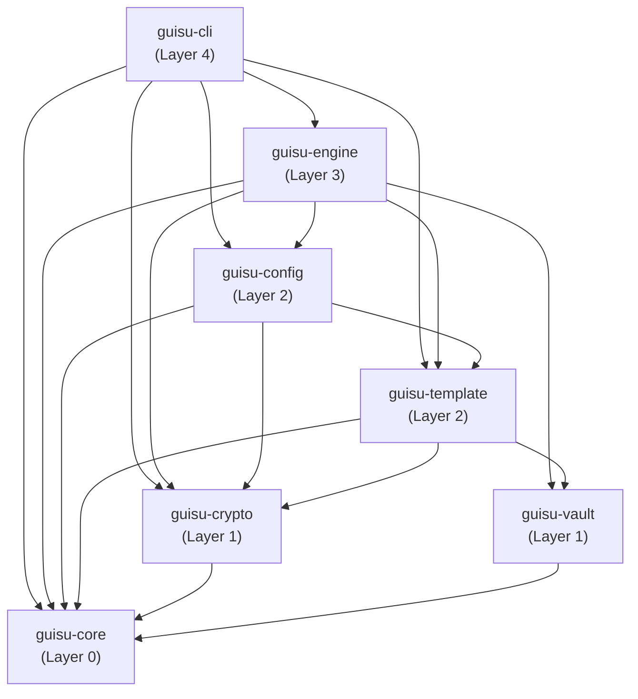

# Architecture

Guisu is a Cargo workspace with 7 crates organised in strict layers. Higher layers depend on lower layers, never the reverse. There are no circular dependencies; `cargo tree --workspace --no-dedupe` confirms it.

## Layer responsibilities (one-line summary)

| Crate | Layer | Role |
| --- | --- | --- |
| `guisu-core` | 0 | Newtype path types, platform detection, error types. Only depends on `std`. |
| `guisu-crypto` | 1 | age identity loading, encryption, decryption, file + inline. |
| `guisu-vault` | 1 | `SecretProvider` trait; built-in `bw` and `rbw` in `bw.rs`, `bws` in `bws.rs`. |
| `guisu-template` | 2 | minijinja env, ~30 functions and filters, platform-aware context. |
| `guisu-config` | 2 | `.guisu.toml` loading, per-platform variables, path resolution. |
| `guisu-engine` | 3 | Three-state model, persistent redb state, parallel processing. |
| `guisu-cli` | 4 | clap argument parsing, command implementations, conflict TUI. |

## Module map

`guisu-engine` is the largest crate. Its `src/` layout is:

| File | What it contains |
| --- | --- |
| `state.rs` | `SourceState`, `TargetState`, `DestinationState`, `PersistentState` trait, redb-backed implementation. |
| `entry.rs` | `SourceEntry`, `TargetEntry`, `DestEntry`, `EntryKind` enums. |
| `attr.rs` | `FileAttributes` (bitflags: DOT, PRIVATE, READONLY, EXECUTABLE, TEMPLATE, ENCRYPTED). |
| `content.rs` | The raw byte pipeline: read, decrypt, render. |
| `processor.rs` | `ContentProcessor<D, R>` — generic decrypt + render pipeline. |
| `database.rs` | redb table definitions. |
| `hash.rs` | BLAKE3 helpers. |
| `modify.rs` | In-place modification of `modify_*` files. |
| `system.rs` | Platform-specific destination state reads. |
| `validator.rs` | Cross-state validation (e.g. is the source well-formed?). |
| `git.rs` | In-process git operations (init, fetch, merge) using `git2`. |
| `hooks/` | Pre/post/once/onchange hook discovery and execution. |
| `adapters/` | Adapters to alternative implementations (e.g. an HTTP-based `SourceState` reader for tests). |

## Why strict layers?

The strict layering buys two things:

1. **Bounded compile time.** A change to `guisu-core` rebuilds the whole workspace; a change to `guisu-cli` rebuilds only `guisu-cli` and the libraries it transitively depends on (which is everything in practice, but the layer check still catches accidental layering violations).
2. **Substitutability.** Library users can pick a subset: a CI tool that just renders templates and never touches the engine can depend on `guisu-template` alone.

## See also

- [Three-State Model](three-state-model.md) — what the engine does.
- [Data Flow](data-flow.md) — how a request moves through the layers.
- [Crates](crates.md) — per-crate public API and responsibility.
