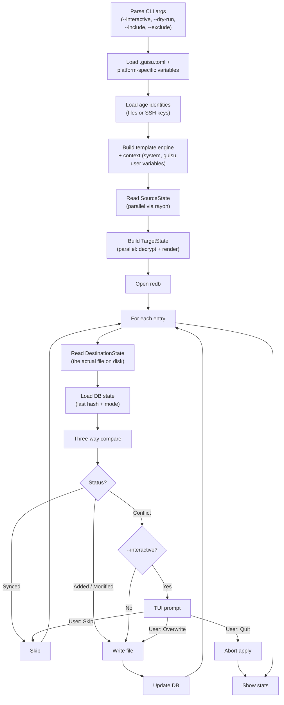
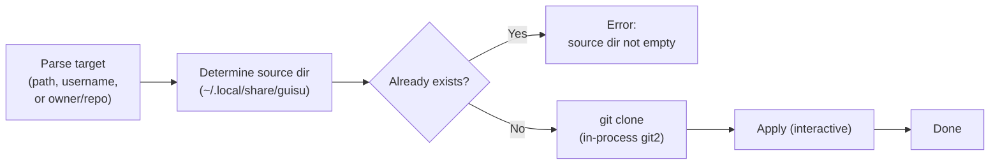
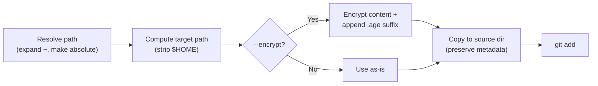
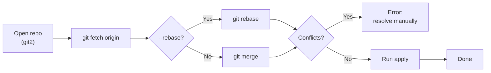
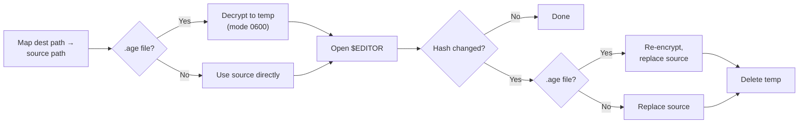

# Data Flow

This page traces the major commands through the layers. Each flow is the same shape: parse args → load config → load identities → read source → build target → compare with destination and database → resolve conflicts → write → update database.

## `guisu apply`

The core command. Materialises source into destination.

Steps E and F use rayon for parallel processing (file I/O and template rendering are embarrassingly parallel). Steps H through Q are **sequential** so that writes happen in a deterministic order and a mid-apply crash leaves the destination in a recoverable state.

## `guisu init`

## `guisu add`

`--template` is handled the same way as `--encrypt` in this flow: the suffix becomes `.j2` instead of `.age`. `--private` and `--executable` do not change the file's location, only the attributes Guisa applies on the next apply.

## `guisu update`

## `guisu edit`

The temp file is on the same filesystem as the source, mode `0600`, and is `unlink()`-ed when the editor exits. Secure erasure (overwrite before unlink) is on the roadmap but not implemented.

## Parallel processing

The engine uses [rayon](https://docs.rs/rayon) for two passes:

| Pass | Operation | What parallelises |
| --- | --- | --- |
| Read source | `SourceState::read(root)` | One task per file system entry: read bytes, parse attributes, build `SourceEntry`. |
| Build target | `TargetState::from_source(source, processor, context)` | One task per source entry: decrypt (if `.age`), render template (if `.j2`), build `TargetEntry`. |

Sequential steps (`write`, `update db`, `compare`) stay single-threaded to keep the on-disk state coherent and the diff output stable.

## See also

- [Three-State Model](three-state-model.md) — the four stores the flows above touch.
- [Crates — guisu-engine](crates.md#guisu-engine) — the types in the flow.
