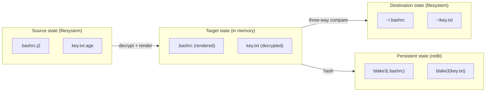

# Three-State Model

The engine keeps three views of every file under management, plus a persistent record of what was last applied. Comparing the four is what makes conflict detection and safe interactive resolution possible.



## The four stores

| Store | Where it lives | Mutable? | Notes |
| --- | --- | --- | --- |
| **Source** | Files in the source repository (filesystem) | Read-only during apply | Filenames encode attributes (`.j2`, `.age`, `dot_`, `private_`, etc.). |
| **Target** | Rendered, decrypted content (in memory) | Recomputed on demand | Always the desired post-`apply` state for a given source. |
| **Destination** | The actual files on the user's machine (filesystem) | Read + Write | Where the user's dotfiles actually live. |
| **Persistent** | `redb` database at `<source>/.guisu-state.db` | Written after a successful apply | Content hash + mode of the last applied target. |

## Status types

For each file under management, the engine computes a status by comparing target, destination, and database:

| Target | Destination | Database | Status | Default action |
| --- | --- | --- | --- | --- |
| A | A | A | Synced | Skip |
| A | B | A | Modified (by you) | Overwrite |
| A | A | B | Modified (in source) | Apply |
| A | B | C | Conflict | Prompt (`--interactive`) or overwrite |
| A | — | — | Added | Create |
| — | B | B | Removed | Delete |
| — | B | A | Modified + Removed | Conflict |

## Entry types

`crates/engine/src/entry.rs` defines three enums and a struct:

```rust
pub enum SourceEntry {
    File { source_path, target_path, attributes },
    Directory { source_path, target_path, attributes },
    Symlink { source_path, target_path, link_target },
}

pub enum TargetEntry {
    File { path, content: Vec<u8>, mode: Option<u32> },
    Directory { path, mode: Option<u32> },
    Symlink { path, target: PathBuf },
    Remove { path },
}

pub struct DestEntry {
    pub path: RelPath,
    pub kind: EntryKind,
    pub content: Option<Vec<u8>>,
    pub mode: Option<u32>,
    pub link_target: Option<PathBuf>,
}

pub enum EntryKind {
    File,
    Directory,
    Symlink,
    Missing,
}
```

`SourceEntry` and `TargetEntry` differ slightly because the source carries an `attributes` bitmask (decoded from the filename) while the target carries concrete content. `TargetEntry::Remove` is a one-way marker: it tells the apply step "this path should not exist after apply, delete it if it does."

## File attributes

`FileAttributes` in `crates/engine/src/attr.rs` is a bitflags struct:

```rust
bitflags::bitflags! {
    pub struct FileAttributes: u8 {
        const DOT        = 1 << 0;  // Hidden file
        const PRIVATE    = 1 << 1;  // Mode 0600 / 0700
        const READONLY   = 1 << 2;  // Mode 0444
        const EXECUTABLE = 1 << 3;  // Mode 0755
        const TEMPLATE   = 1 << 4;  // .j2 extension
        const ENCRYPTED  = 1 << 5;  // .age extension
    }
}
```

These flags are decoded from the filename at read time and applied at write time. See [User Guide — File Attributes](../user-guide/file-attributes.md).

## See also

- [Data Flow](data-flow.md) — apply / init / add / update flows.
- [Crates — guisu-engine](crates.md#guisu-engine) — the public API for state types.
